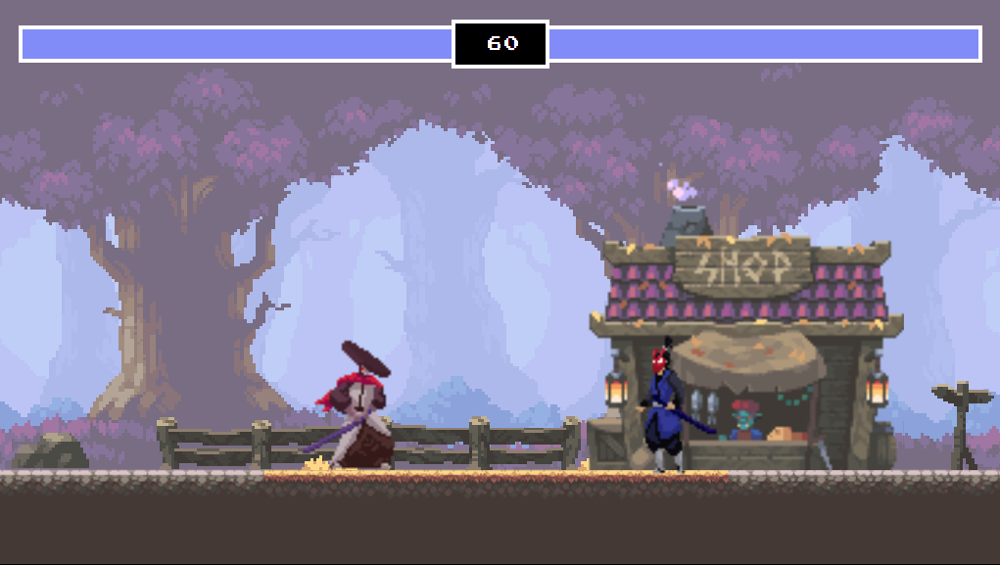

# Fighting Game with JavaScript and HTML Canvas

Fighting game using JavaScript and HTML canvas! In this project, Most basic fighting game mechanics along with incorporating professional sprite sheets and graphics.

## Description

Creating a fighting game is an exciting endeavor that allows you to unleash your creativity and programming skills. By leveraging the power of JavaScript and HTML canvas, you'll be able to bring your game to life in the browser, making it accessible to a wide audience.

## Features

- **Basic Fighting Mechanics**: Implement basic fighting game mechanics such as player movement, attacks, and collisions.
- **HTML Canvas**: Utilize HTML canvas to render the game graphics and animations.
- **Sprite Sheets**: Incorporate professional sprite sheets to animate characters and actions.
- **Player Controls**: Implement player controls for movement, blocking, and attacking.
- **Scoring System**: Implement a scoring system to track player performance and progress.

## Technologies Used

  
  
  

## Getting Started

To get started with creating your fighting game, follow these steps:

1. Set up your development environment with a text editor and web browser.
2. Create the HTML file to structure your game layout and canvas element.
3. Write JavaScript code to implement game mechanics, player controls, and interactions.
4. Incorporate sprite sheets and graphics to enhance the visual appeal of your game.
5. Test your game thoroughly to ensure smooth gameplay and functionality.
6. Fine-tune and iterate on your game to improve performance and user experience.

## Resources

  

- **Sprite Sheets**: Find professional sprite sheets online or create your own using graphic design software.
- **Game Development Libraries**: Explore game development libraries and frameworks such as Phaser.js or PixiJS for additional features and capabilities.
- **Game exe**: The Game based on the web game [download](https://www.mediafire.com/file/dw1uosz7ib1pmnm/Fight_ME_Monk.zip/file)
image resources
-    [Oak Woods Assets:](https://brullov.itch.io/oak-woods)
-    [Evil Monk:](https://luizmelo.itch.io/martial-hero)
-    [Samurai: ](https://luizmelo.itch.io/martial-hero-2)
-    [Background](/img/background.png)

## Examples

Check out these inspiring examples of fighting games created with JavaScript and HTML canvas for inspiration:

- [Street Fighter](https://github.com/jakesgordon/javascript-koans)
- [Mortal Kombat](https://github.com/abagames/crispy-giggle)
- [Super Smash Bros](https://github.com/pakastin/deathmatch)
## <i class="fas fa-whistle"></i> Let the battle begin!

---

© 2024 [Ali Cheikh]. All rights reserved.
